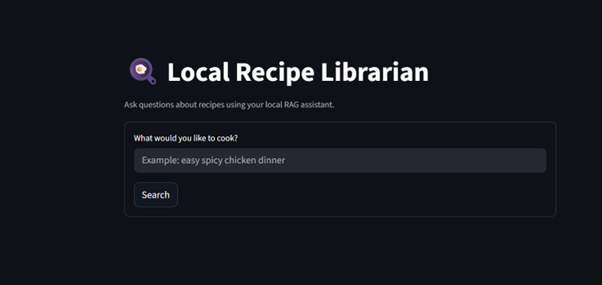
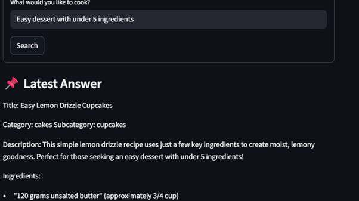
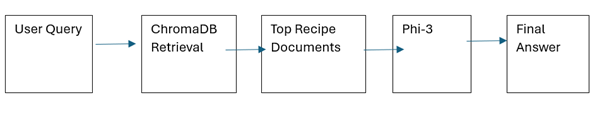

# Local Recipe Librarian (RAG Project)

A local Retrieval-Augmented Generation (RAG) application that allows users to search a recipe knowledge base using natural language queries and receive grounded responses from a locally hosted language model.

This project was built to demonstrate practical understanding of:

* Large Language Models (LLMs)
* Vector Databases
* Embeddings
* Semantic Search
* Retrieval-Augmented Generation (RAG)
* Local AI Deployment

## Demo Screenshots
### Homepage



### Example Query Result



### System Architecture



## Features

* Search thousands of recipes using natural language
* Semantic retrieval powered by embeddings
* Local vector database using ChromaDB
* Grounded answers generated from retrieved recipe data only
* Metadata filtering (category, steps, ingredients etc.)
* Fully local inference using Ollama
* Simple Streamlit web interface

## Example Queries

* Easy spicy chicken dinner
* Vegetarian pasta under 30 minutes
* Dessert with fewer than 5 ingredients
* What can I cook with eggs and potatoes?

## Evaluation

A lightweight evaluation script (`evaluate.py`) was added to test sample user queries, measure response time, and validate end-to-end retrieval performance.

## Tech Stack

* Python
* Pandas
* Streamlit
* ChromaDB
* Sentence Transformers
* Ollama
* Phi-3 Mini (local LLM)

## How It Works

1. Recipe CSV dataset is cleaned and converted to JSONL
2. Each recipe is transformed into a searchable document
3. Documents are embedded using a sentence transformer model
4. Embeddings are stored in ChromaDB
5. User submits a natural language query
6. Most relevant recipes are retrieved
7. Retrieved context is passed into a local LLM
8. Grounded response is generated for the user

## Architecture

Project Structure
```text
Local_Recipe_Librarian_RAG_Project/
│── app.py
│── preprocess.py
│── documents.py
│── build_vector_db.py
│── evaluate.py
│── retriever.py
│── rag_pipeline.py
│── data/
│   ├── raw/
│   └── processed/
```

## Why This Project

Many LLM applications rely on external APIs and hallucinate information.

This project demonstrates how to build a **private, local, grounded AI assistant** that answers questions using trusted internal data.

## Future Improvements

* Conversation memory
* Advanced filtering UI
* Docker deployment
* Better reranking models
* Nutrition-aware recommendations
* Multi-dataset librarian system

## Run Locally

```bash
pip install -r requirements.txt
streamlit run app.py
```

## Author: Joel Utoware

Built as a portfolio project to demonstrate practical AI/ML engineering skills.